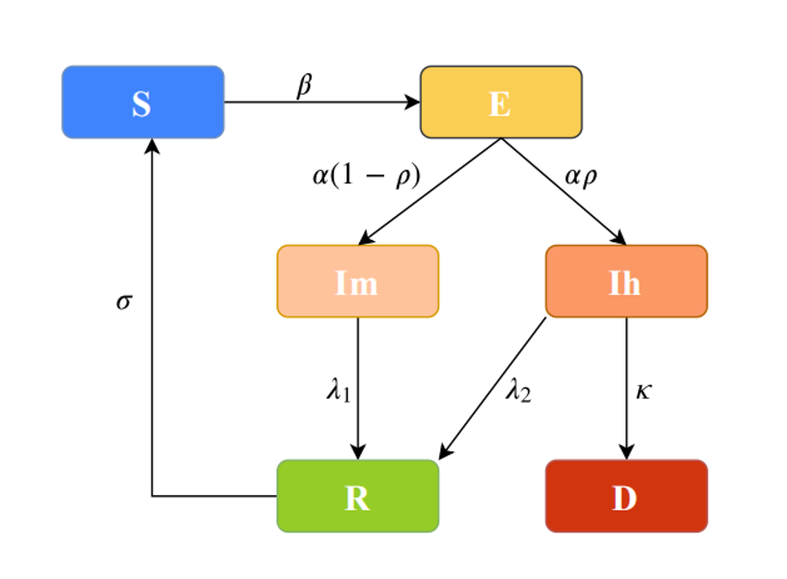
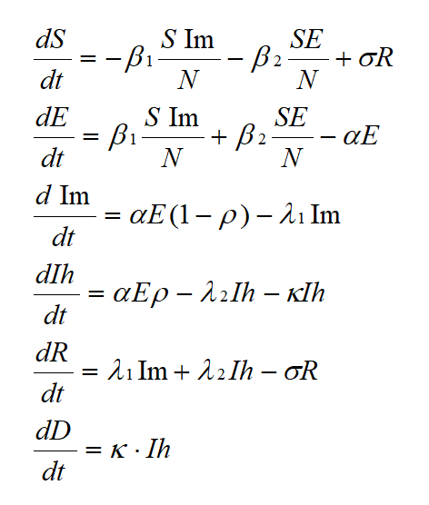

# SEIR-MHD

##Abstract:

This is an epidemic model design and developed for BHSF IT to forecast the ventilator and Icu bed usage 
durning Covid-19.

## Model Design

The model is an adjusted(modified) SEIR based on the generalized epidemic model. It has following key assumptions:

	- People during the incubation period are infectious
	- Hospitalized patients are considered as quarantined
	- Patients who recovered could be infected again

Equation:

## How to use

The executable python file is under /src folder

>  Python SEIR_plus.py

## Format of input file

There are two required input files in order to run the model, these input file should be placed into /data folder and follow 
the example format

**data.csv** 

|   | Date       | positive_IP_count | pos_discharged_count | pos_deceased_count | current_vent | current_icu |
|---|------------|-------------------|----------------------|--------------------|--------------|-------------|
| 0 | 2020-03-11 | 1               | 0.                  | 0.                | 0            | 0           |
| 1 | 2020-03-12 | 0               | 0.                 | 0.                | 0            | 0           |
| 2 | 2020-03-13 | 1              | 0.                  | 0.                | 0            | 0           |

**parameters.csv**

|                          | Value                |
|--------------------------|----------------------|
| Predict_Days             |                  |
| Hospital_Market_Share    |                  |
| Population               |            |
| Infected                 |               |
| Death                    |                 |
| Recovered                |                   |
| Hospitalized_Patient     |                  |
| Hospitalized_Percentage  |  |
| Hospital_Average_Stay    |                 |
| ICU_Percentage           |   |
| ICU_Average_Stay         |                   |
| Ventilator_Percentage    |  |
| Ventilator_Average_Days  |                  |
| Double_time              |                   |
| Duration_of_Immunization |                  |
| Death_Rate               |                 |
| Mean_Latent_Period       |                  |
| Mean_recovery_time       |                  |
| Social_Distance          |                   |

## Outputs

The outputs include two files **Forecast_Result.csv** and **Prediction_Interval.csv** are under /result folder.

